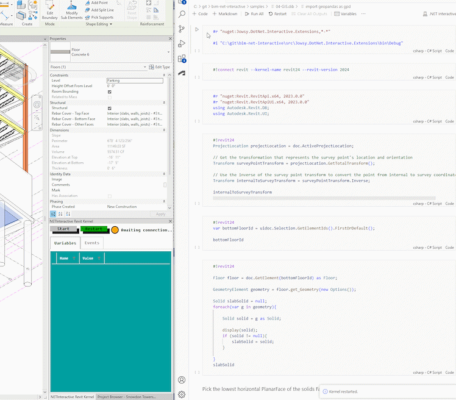

# BIM Interactive Notebooks

This is a personal project that explores the possibility to run live Revit C#-scripts inside notebooks bundled with visualizations and narrative text. 

This has resulted in different parts:
1. A Revit Addin (Technically a implementation of a NET interactive kernel)
2. Visual Studio Code Polyglot Notebooks extension
3. A collection of showcase notebooks (see /samples/) (IN PROGRESS)

## Revit addin
There is a quite stable version of the addin. I am working on an installer.

## System Prompting LLM
When using CHAT-GPT to write revit API Code for use in the notebook you would probably want to steer it's behaviour to minimize editing the code for use in an interactive context.
See [System Promts](https://github.com/jowsy/bim-net-interactive/tree/main/samples/system-prompts/) for some initial drafts.

Begin conversation by:
> [SYSTEM] {System prompt text}

## Extension to VS Code Polyglot Notebook
The idea is to run scripts with [Polyglot Notebook Extension](https://marketplace.visualstudio.com/items?itemName=ms-dotnettools.dotnet-interactive-vscode), an extension to Visual Studio Code, a free code editor.

In Visual Studio Code, open a new notebook and create a code cell to enable the revit interaction using the #r directive.
```csharp
#r "nuget:RevitInteractive"
```

Use the #connect-directive to establish live connection to revit. This requires an addin.
```csharp
#!connect revit --kernel-name revit24 --revit-version 2024
```

Then inside a code cell, execute the code inside Revit using a magic command for the kernel:

```csharp
#!revit24   
var collector = new FilteredElementCollector( doc, uidoc.ActiveView.Id);

var query = collector
        .WhereElementIsNotElementType()
        .WhereElementIsViewIndependent()
        .ToElements();

var result = query.GroupBy(x => x.Category.Name).Select(y => new {
    Id = y.Key,
    Count = y.Count()
}).ToList();

display(result);
result
```
## Examples

Extracting profile geometry from floor and export to shapefile for GIS-visualization using C# and Python (with Shapely and Geopandas).

See [samples/GIS/GIS Visualization Building Footprint.ipynb](https://github.com/jowsy/bim-net-interactive/blob/main/samples/GIS/GIS%20Visualization%20Building%20Footprint.ipynb)



## Limitations

The Revit API is tightly coupled with the Revit UI and the Revit document data structures and operates on the assumption that it's being called within the same process where the UI and the document are loaded.
This prevents you from calling the API from for example a polyglot notebook without some kind of middle-man or dispatcher.

## Current solution
NET interactive operates with kernels. A *kernel* is simply a process that receives execution instructions from clients and communicates the results back to them. The decopuled two-process model where you separate execution from evaluation allows for an approach where an evaluator can live inside Autodesk Revit as an addin and receives code from frontend clients such as Polyglot Notebook, Azure Data Studio or Jupyter.

In .NET Interactive a *proxy kernel* is a concept that describes a subkernel that proxies a remote kernel. We can add a proxy kernel to the composite kernel that routes commands to the actual implementation written as a Revit Addin. The revit addin implements a NET Interactive kernel process and executes code in the Revit API thread using external events(check Jeremy Tammik's arcticle [External Access to the Revit API](https://thebuildingcoder.typepad.com/blog/2017/05/external-access-to-the-revit-api.html) for more info on this topic). 

However, due to the issues with third-party conflicts regarding the Roslyn API:s it was a hurdle to compile the code in the Revit addin so I tested to move the compilation before the code is sent to the embedded kernel in Revit. Technically, it is done using a registered middleware on the proxykernel that compiles the code and then send the path to the compiled assembly to the revit addin which loads it into memory and executes a method defined in a common interface with a list of common variables.

## Resources

* [IPython](https://ipython.org/ipython-doc/stable/overview.html#ipythonzmq)
* [NET Interactive](https://github.com/dotnet/interactive)
* [Literate Programming with LLMs](https://matt-rickard.com/literate-programming-with-llms)
* [Jupyter BIM](https://github.com/chuongmep/JupyterBIM)
* [ChatGPT System Prompts](https://github.com/mustvlad/ChatGPT-System-Prompts/tree/main)
* [dnMerge](https://github.com/CCob/dnMerge)


## Aknowledgements and third-party dependencies

* Built on top of [NET Interactive](https://github.com/dotnet/interactive)
* Got a lot inspiration from [RevitAddinManager](https://github.com/chuongmep/RevitAddInManager) for how to configure csproj.
* Credit to Alexander Sharykin for his [https://github.com/jowsy/RetroUI](RetroUI) WPF theme (forked by me and adapted for use in a Revit addin).

## License

MIT
